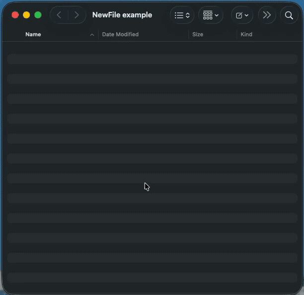

# NewFile — New File button for macOS Finder

**Free, open-source, native.** A small [Finder Sync Extension](https://developer.apple.com/documentation/findersync/fifindersync) that adds the missing "New File" button to macOS Finder — right-click menu and toolbar. No Automator, no shell scripts, no setup beyond enabling the extension once.

- **Any file type** — `.txt` enabled by default, plus 7 built-in presets (`.md`, `.json`, `.sh`, `.env`, `.yml`, `.gitignore`, `.html`). Add your own (`.tsx`, `.toml`, whatever you need).
- **Starter templates** — pre-fill new files with frontmatter, shebang lines, a JSON skeleton, or any boilerplate you reuse.
- **Drag-to-reorder** — set the menu order in Preferences; the first enabled type is the toolbar's one-click action.
- **Submenu mode** — optionally collapse all types under a single "New File ▸" right-click entry.
- **Auto-incrementing names** — `New Text File.txt`, then `New Text File 2.txt`, and so on. Reveals and selects the new file.
- **Auto-updates** via Sparkle — no need to re-download.

> macOS Finder lets you create a New Folder but not a New File. NewFile fixes that — the way it should have shipped.



## Install

### Homebrew (recommended)

```sh
brew install mariusgm/newfile/newfile
```

### Manual

1. Download the latest `NewFile.dmg` from [Releases](https://github.com/mariusgm/newfile/releases).
2. Drag `NewFile.app` to `/Applications`.
3. Launch it once. Follow the in-app instructions to enable the Finder extension.

## Enable the Finder extension (one time)

System Settings → **General → Login Items & Extensions** → scroll to **Added Extensions** → toggle **NewFile Extension**.

> On macOS Sequoia 15.0 and 15.1 the Extensions UI was buggy — update to 15.2 or later if NewFile Extension doesn't appear in the toggle list.

## Add the toolbar button

In any Finder window: **View → Customize Toolbar…** → drag the NewFile icon into the toolbar where you want it.

## Use it

- **Toolbar button**: click → menu pops with "New Text File" → click → file created and selected.
- **Right-click**: anywhere in a Finder window background → "New Text File".

The created file is named `New Text File.txt`. If that name exists, it becomes `New Text File 2.txt`, then `New Text File 3.txt`, and so on.

## Customize

Open **NewFile.app → ⌘,** (or click the toolbar dropdown → **Customize…**) to manage file types, templates, menu order, and submenu mode. Leave a base name empty for dotfile-style names (`.env`, `.gitignore`).

## Build from source

```sh
git clone https://github.com/mariusgm/newfile.git
cd newfile
brew install xcodegen
xcodegen generate
open NewFile.xcodeproj
```

In Xcode: select the **NewFile** scheme, ⌘R to build & run. See [`setup.md`](setup.md) for code signing and notarization notes if you want to distribute your own build.

### Project layout

```
newfile/
├── App/                 SwiftUI host app — onboarding window only
├── Extension/           FIFinderSync subclass — toolbar + context menu + file creation
├── project.yml          xcodegen project definition (regenerable)
├── README.md
└── setup.md             codesigning + notarization + release notes
```

The host app (`NewFile.app`) is intentionally minimal — its only job is to embed the Finder Sync extension and present onboarding. All the work happens in `Extension/FinderSync.swift`.

## How it works

NewFile is implemented as a [Finder Sync Extension](https://developer.apple.com/documentation/findersync/fifindersync) (`FIFinderSync`) — Apple's supported way to add toolbar buttons and context menus to Finder. It runs sandboxed under macOS's app extension model. No private APIs, no SIMBL, no Finder injection.

When you click the toolbar button or context menu item:
1. The extension reads the targeted folder via `FIFinderSyncController.targetedURL()`.
2. It picks a unique filename (`New Text File.txt`, then `New Text File 2.txt`, etc.).
3. It creates an empty file with `FileManager.createFile`.
4. It calls `NSWorkspace.activateFileViewerSelecting` to reveal and select the file.

## License

[MIT](LICENSE) — do whatever, no warranty.

## Related

- [MacNewFile](https://github.com/GarfieldFluffJr/MacNewFile) — older Objective-C implementation of the same idea
- [New File Menu](https://apps.apple.com/us/app/new-file-menu/id1064959555) — paid MAS alternative ($2.99)
- [iBoysoft MagicMenu](https://iboysoft.com/magic-menu/) — paid right-click utility ($19.99/yr) that bundles new-file
